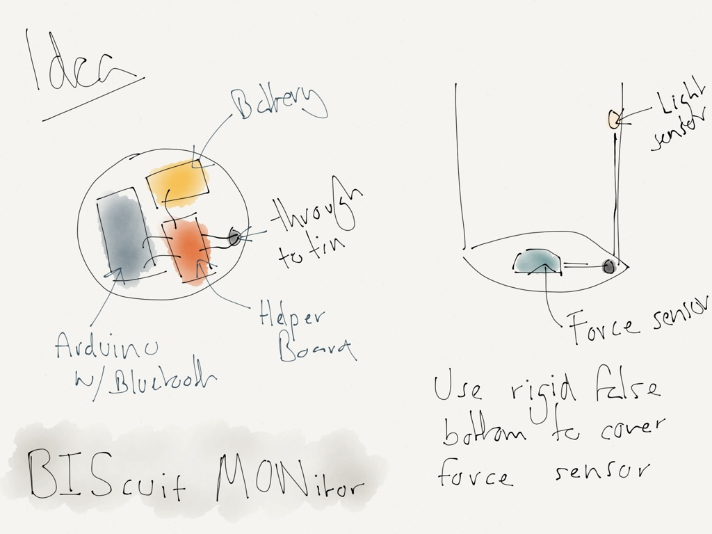
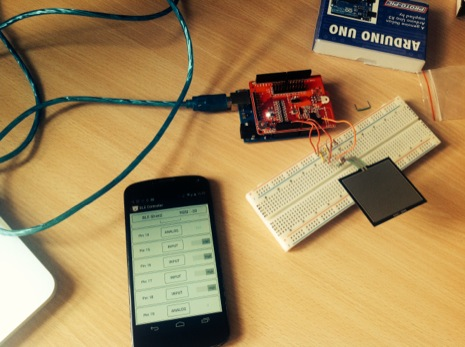
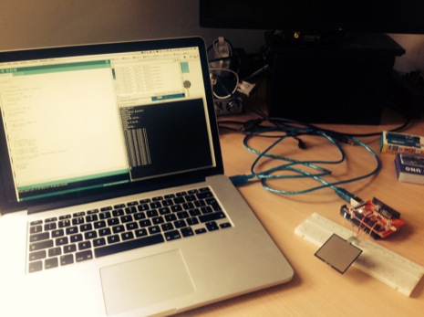
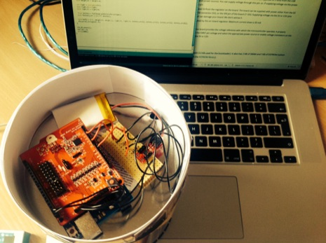
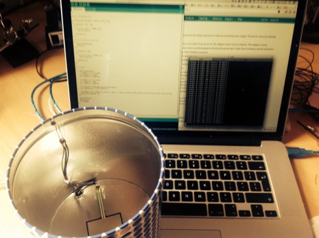

---
title: BIScuit MONitor
...

A data collecting, Arduino powered, bluetooth biscuit tin.

I have the pleasure of working with [a team](https://www.gov.uk/performance) who seem to love biscuits almost as much as we love data. The idea for a data reporting biscuit tin has been floating for the last six months or so and I've finally had a stab at building it.

We wanted a tin that would report how full it was, mostly to track a steady decline and to insure the tin never goes empty, and when it was opened. Once we have this data rolling in we would like to see how it correlates with other metrics we already record about our team. Given that we work on a product that stores data and visualises it, a requirement is that we would have an **unofficial** dashboard about our biscuit consumption.

## Prototype

Every successful project should start with a prototype. Building a prototype will let you test out your hypothesis and see if it passes.

### Parts

As can be seen in my initial sketches above I had quite a strong idea of how I wanted the project to work.

### Assembly

 The first step of prototyping the idea was to assmeble the Arduino, shield and sensors to make sure they are worked as expected.

 Writing a basic client app.

 Sticking the electronics to the bottom

 Sensor in the tin
